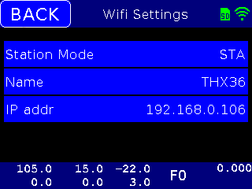
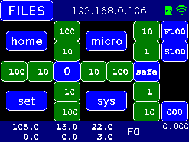

# FluidNC_UI - Functional Overview

**[Home](readme.md)** --
**Overview** --
**[Software](software.md)** --
**[Installation](installation.md)**

## 1. The Application

The application has a **title bar** with the **main button** to the left,
and an **indicator area**, showing the state of the *SD Card* and *WiFi*,
to the right.  The title displayed in the middle shows the
ESP32's IP address by default or other information while running,
depending on the user's location within the UI and the state of the machine.

You can *click on the title bar* to see details about the **WiFi configuration**:

There is a **status bar** at the bottom of the screen that
shows the **machine and work coordinates** in two rows of three columns
for the X,Y, and Z axes, respectively.  By default, the rest of the status bar shows the
current **instantenous feed rate**,  the live **z-offset**, and if engaged, the
**mesh z offset** at the given coordinate.

Clicking on the bottom **status bar** will toggle between displaying
the current *feed rate and z-offset* (and possibly the *mesh_offset*), versus showing the
current *machine state* and *current and lowest memory available*
on the ESP32, in kilobytes, in the right portion of the status bar,
as shown above.

 

## 2. The Main Window

The system starts with the **Main Window** (above) which contains the **jog buttons**
that let you move the spindle 100 or 10 millimeters at a time,
a button to take you to the current XY **zero** (0) work position,
buttons to allow you to **home** the machine, **set** the zero positions
for each axis, toggle the jog buttons into **micro** mode for smaller movements,
and/or *reboot* or *reset* the machine from the **system** button.
The z-axis **safe** button will move the z-Axis to it's *home* position
with the z-axis homing **pulloff** amount applied.

*Generally the first thing you will do upon booting up the machine
is to **home** it.*

Additionally there are buttons in the rightmost column to allow you to
adjust the **feed rate**, **spindle speed**, and live **z-offset**.

 

### Toggling to Micro Mode

If you press the **micro** button, the jog values will change to
allow you jog the X and Y axis in increment of 1 and 1/10mm,
and the Z axis in increments of 1/10th and 1/100th of a mm
at a time.

The micro button will show in **bright green** if micro
mode is enabled, or in blue if it is not.

 

### Main Window Modes

The main window will automatically be replaced by a number of other
windows under certain circumstances.  In these cases you can no-longer
access the *jog buttons*:

- when the machine is **running a job** from the SDCard
- when the machine is in the proccess of **Homing**, **Probing**, or **Meshing**
- when the machine is in an **alarm state** due to a limit switch or other problem.

While the machine is in one of these states, you are presented with specific
windows that allow you to do appropriate actions at that point;

 

### 2a. The "Busy" Window (running an SDCard Job)

When the machine is running an *SDCard job* you will be presented with
the following window, which will show the **percentage completed** at
the top of the window, and a **progress bar** in green on the *status bar*
The *SDCard indicator* changes to yellow to show that the SD Card is busy.

The name of the **current file** is shown in bold yellow (*drill.gcode* in
this example).

You can press the **Pause/Resume** button to safely pause and resume the
job, the **Reset** button to stop the job in progress, but otherwise
leave the machine unchanged, or the **Reboot** button to stop everything
and entirely reboot the ESP32 FluidNC controller.

There are also buttons to allow you to adjust the **Feed Rate** (F100),
**Spindle Speed** (S100) and **Live Z Offset** (000) in realtime,
*while the job is running*.

 

### 2b. The Homing and Probing Windows

You can choose to *"home** one, or all of the axes, or to perform
a **probe** via the *Homing Dialog* window.

While *homing* or *probing* the window will change to something like
this:

Once you have started a *homing* or *probing* cycle, your only
alternatives are to (a) let it **complete**, (b) **reset** the
CNC controller (*FluidNC* state machine), or to (c) entirely
**reboot** the ESP32.

**Homing** issues the standard **$H**, **$HX**, **$HZ**,
ir **$HZ** commands to the *FluidNC* GRBL gcode interpreter.

**Probing** issues the standard **G38.2**,
gcode command to the *FluidNC* GRBL gcode interpreter,
and if successful, **sets the z-axis zero position**
and *pulls off* a few millimeters.

Note that probing **requires a board/machine that supports
a probe input**.

TODO: disable probe UI if no probe pin defined in the yaml file.

 

### 2c. The "Meshing" busy window

The FluidNC_UI supports **mesh bed levelling** as implemented in the
[**FluidNC_extensions**](https://github.com/phorton1/Arduino-libraries-FluidNC_extensions)
library.

*Mesh bed levelling* may be useful when a high accuracy in the z-axis is required,
for example while **milling PCB boards**.

To use the mesh, you configure the *height and width* of the mesh, and the
number of "steps" in the x and y directions with the **Mesh Settings**
dialog (as shown in the "Other Windows" section of this readme, below).

Then, once you you select **Mesh** from the "Homing
Dialog* the "meshing" process begins. Since creating the mesh can take a
substantial amount of time, the "meshing" window shows the progress
of the process as it proceeds:

The machine will **probe** a grid as defined in the mesh settings
and create a *map* of the heights that it will then use going
forward.  The mesh is created at whatever location the spindle
happens to be at when the command is issued.    When the mesh
generation is finished the **z-Axis zero position will be set**
and the spindle will be returned to its original location.

When a mesh exists it is **active** and the *status bar* will
show the mesh offset at any given point as the spindle moves
around:

In the above example, the mesh calculates that the *work
surface* is 0.114 mm above the "zero point" at
absolute machine coordinates X=25 and Y=5, which in
this case corresponds to work coordinates X=-80 and Y=-10.

Note that meshing **requires a board/machine that supports
a probe input** and that this library is compiled with the
**WITH_MESH** definition in *gDefs.h*, and that the machine
itself implements the *FluidNC_extensions* mesh feature.

Once a mesh is created *it remains in effect until it
is **cleared**, including through **reboots** and **resets**
of the machine.  You can *clear the mesh* by pressing the
**Clear** button in the *Homing Dialog" window as shown
below.

When the *Clear button* is **green** there is a
mesh active.  When it is **greyed out** there is
no mesh active.

The mesh is stored on the SPIFFS file system in a
file called **mesh_data.txt**.  You can access it,
modify it, and/or remove it by using the **WebUI**
to get to the SPIFF file system.

 

### 2d. The Alarm Window

 

## 3. The Files Window

You access the **Files Window** by pressing the **Files** button from the *Main Window*.
Once in it, you can press the **Main** button to return to the *Main Window*.

If there is an *SDCard* this window lets you **traverse directories** and select files
on it to "run" as jobs on the cnc machine:

The traversal buttons are only shown when appropriate, so you *may not
see them* if there are no subdirectories and 5 or less files on the SDCard.

Sub-folders are shown with a leading slash **/**.
You traverse to (enter) a sub-folder by clicking on the directory name
in the list.

Once you **click on a file**, you will be asked if you want to "run" it.
If you then click the "Yes" button from the *confirmation dialog*,
the given **gcode file** will begin to run on the CNC machine.

The recognized GCode extensions are:

- **.G**
- **.GC**
- **.GCODE**
- **.NGC**

If you click on a file without one of the above extensions
you will receive an error message.

 

## 4. Other Windows (Dialogs) in the system

### Homing Dialog

### Set Positions Dialog

### System (reboot, reset) Dialog

### Feed Rates Dialog

### Mesh Settings Dialog

### Confirmation Dialog(s)

 

<a href='software.md'>NEXT</a><i> - Software Architecture and Details ...</i>

