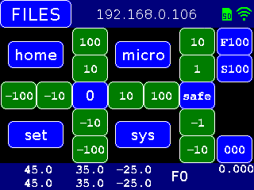
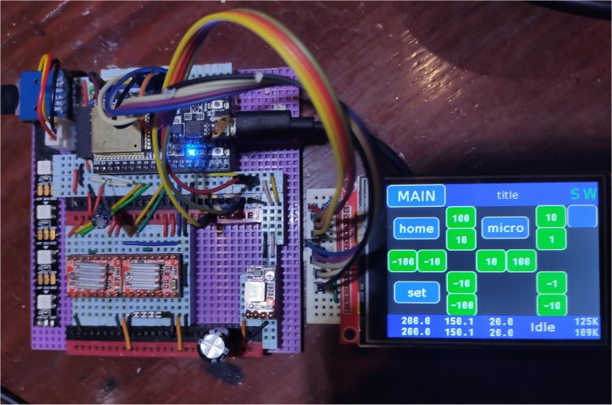

# FluidNC_UI - Home

**Home** --
**[Overview](overview.md)** --
**[Software](software.md)** --
**[Installation](installation.md)**

This library provides a user interface to **FluidNC** on a **320x240**
*ILI9431* based SPI **TFT touch screen**.
It makes use of the [**TFT_eSPI**](https://github.com/phorton1/Arduino-libraries-TFT_eSPI)
library to drive the TFT.

It is based on [my fork](https://github.com/phorton1/Arduino-libraries-FluidNC) of the
**bdring/FluidNC** project.

It is designed to have a minimal impact on RAM usage and a small footprint
in program memory.  It makes no use of memory allocated dynamically at runtime.
Here is a photo of an early prototype of a CNC machine controller board that
I used to begin development of the UI:

## Organization of Documentation

On these pages you can find documentation for the FluidNC_UI, including:

- an **[Overview](overview.md)** of the User Interface
- details about the **[Software](software.md)** Architecture, and
- a guide to **[Installing](installation.md)** this library in your Arduino IDE

## Please Also See

Please also see the following repositories and their readme files for more information:

- [**my fork**](https://github.com/phorton1/Arduino-libraries-TFT_eSPI) of the **Bodmer/TFT_eSPI** library
- [**my fork**](https://github.com/phorton1/Arduino-libraries-FluidNC) of the **bdring/FluidNC** library.
- [**FluidNC_extensions**](https://github.com/phorton1/Arduino-libraries-FluidNC_extensions) - a number of *extensions* to FluidNC; some used by this library.
- [**esp32_cnc301832**](https://github.com/phorton1/Arduino-esp32_cnc3018) - an implementation of an inexpensive 3-axis **3018** cnc machine using this code.
- the [**vMachine**](https://github.com/phorton1/Arduino-_vMachine) - a *Maslow-like* **vPlotter** cnc machine using this code.

## Credits and License

This library is licensed under the
[GNU General Public License v3.0](https://github.com/phorton1/Arduino-libraries-FluidNC_UI/tree/master/LICENSE.TXT)

**Credits**

- To **Bodmer** for the open source **TFT_eSPI** library
- To **bdring** and the **FluidNC Team** for their hard work on the next generation GRBL processor.

 

<a href='overview.md'>NEXT</a><i> - an Overview of the UI ...</i>

