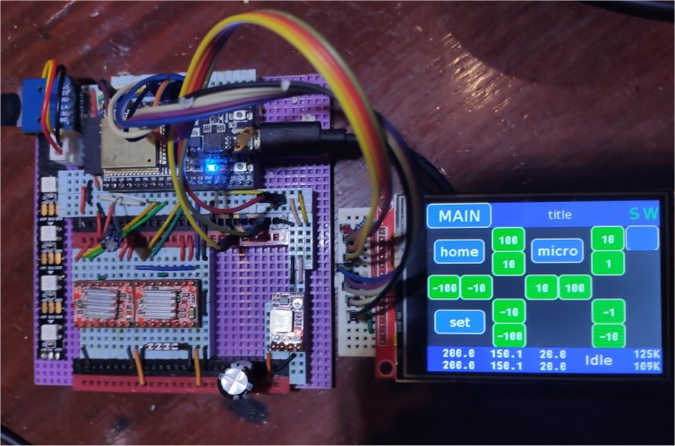

# FluidNC_UI

This library provides a user interface to **FluidNC** on a TFT touch screen.
It makes use of the **TFT_eSPI** library to drive the TFT.

It is based on [my fork](https://github.com/phorton1/FluidNC) of the
**bdring/FluidNC** project.

It is designed to have a minimal impact on RAM usage and a small footprint
in program memory.  It makes no use of memory allocated dynamically at runtime.

The system consists of a tree of *uiWindows*, starting with the **gApplication**.

The gApplication has a *title bar* at the top and a *status bar* at the bottom
of the screen, and in-between them is the *content area* which generally contains
the various uiWindows that make up the system.

The title bar contains the *application button*, the *title text* area, and
an *indicator area* containing the SDCard and Wifi indicators.

The **app button** provides access to the various functionality in the program.

The **title text** provides the user with context about their location in the
program and the state of the FluidNC gcode machine.

The **status bar** gives the *machine* and *work* **coordinates**, the *gCode machine*
**state**, and the available, and least available, dynamic **memory** in kilobytes.

The status bar also doubles as a *progress bar* when a **SDCard "job"** is running.

## File and Object Naming Convention

**FluidNC_UI.h and cpp** are the interface to external clients who just call
the *FluidNC_UI_init()* method.  Everything else just "happens" as a result
of the **gDisplayTask** which calls *app->update()* at the refresh rate.

Apart from that, the objects and filenames are built in layers, from the
bottom up (lower layers generally do not know about higher layers):

- **ui** - the *UI* layer is a somewhat general purpose windowsing system
  implemented on top of TFT_eSPI.  It includes the basic *uiElement* and
  *uiWindow* objects.
- **g** - the *G* layer is the Grbl specific appplication and implements
  the window update and event system.
-- **win** - objects starting with *win* are the top level windows that
  occupy the content area and make up the application.
-- **dlg** - object starting with *dlg* are somewhat reusable dialog windows
  like the *dlgConfirm* uiWindow.

## Main Windows

The system consists of a nunmber of *main windows* that can be accessed
via the *app button* and/or which are presented by the system depending
on the *gCode Machine state*.

- **winMain** - the *idle window* is the default window that shows when
   the system is not "busy" or in an "alaram* state.  It generally
   shows the *jog* or *G0* navigation panel, the *home* button, and
   so on.
- **winBusy** - when an SDCard job is initiated the system automatically
  changes to the *busy window*, which, among other things, allows the user
  to **pause and resume** the SDCard job, **reset the gMachine** and/or
  **reboot the ESP32**.
- **winAlarm** - if an *Alarm* is encountered the sytstem will switch
  to the *alarm window* which allows the alarm to be cancelled,
  and also to **reset the gMachine** and/or
  **reboot the ESP32**.

The system will automatically show the *busy* and *alarm* windows if
it encounters a change to one of those two states, regardless of what
other window the user happens to be in at the time.

Otherwise, the user is free to switch to one of those, or one of the
following, windows depending on their logical availablity based on
the state of the gMachine.

For example, the **busy window** contains the fields which allow
the user to change the override *feed rates*.   Those can be
change when a job is run, or when the machine is idle, though
the *pause/resume* button within the busy window will be disabled
unless a job is actually running.

Other windows include:

**winFiles** - allows the user to navigate the **SD Card** and
    initiate jobs.

**winPrefs** - allows the user to set their preferences for the UI
**winConfig** - allows the user to modify (select) GCode Parameters
